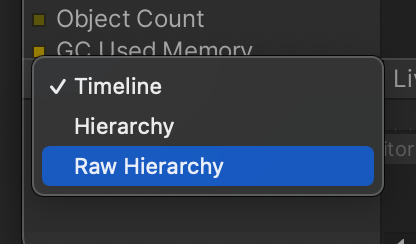

# Unity Tips & Best Practices

The topics listed here are for reference to get familiar with using Unity, from basic tips on working with Unity to best practices.

<details>
<summary> Table Of Contents </summary>

- [Unity Tips \& Best Practices](#unity-tips--best-practices)
  - [1. Unity Editor](#1-unity-editor)
    - [Project view](#project-view)
    - [Scene view](#scene-view)
    - [Hierarchy](#hierarchy)
    - [Game view](#game-view)
    - [Inspector](#inspector)
    - [Console](#console)
    - [Layers](#layers)
      - [Package Manager](#package-manager)
      - [Services](#services)
      - [Rendering -\> Lighting](#rendering---lighting)
      - [Animation \& Animator](#animation--animator)
      - [Audio Mixer](#audio-mixer)
      - [Profiler](#profiler)
      - [AI -\> Navigation](#ai---navigation)
  - [2. Scripting \& The Unity Editor](#2-scripting--the-unity-editor)
    - [Public variables](#public-variables)
    - [Using Pre-made scripts](#using-pre-made-scripts)
    - [Prefabs and instances](#prefabs-and-instances)
    - [Sprites](#sprites)
    - [Sounds](#sounds)
  - [3. Scripting](#3-scripting)
    - [Differences between Javascript and C# (for Unity)](#differences-between-javascript-and-c-for-unity)
    - [Types and classes in C# (for Unity)](#types-and-classes-in-c-for-unity)
    - [Unity's built-in functions/methods](#unitys-built-in-functionsmethods)
    - [Script order of execution](#script-order-of-execution)
    - [How scripts talk to each other](#how-scripts-talk-to-each-other)
  - [4. Physics](#4-physics)
    - [Raycasting](#raycasting)
    - [AddForce](#addforce)
    - [Velocity](#velocity)
    - [Checking Collisions](#checking-collisions)
    - [Physics Tips](#physics-tips)
      - [Use Update for graphics, and FixedUpdate for physics](#use-update-for-graphics-and-fixedupdate-for-physics)
      - [Move the Rigidbody, not the Transform](#move-the-rigidbody-not-the-transform)
  - [5. Miscellaneous](#5-miscellaneous)
    - [Play mode edits = lose changes](#play-mode-edits--lose-changes)
    - [Separate Graphics From Physics And Logic](#separate-graphics-from-physics-and-logic)
    - [Transform](#transform)
    - [Instantiate by component/script](#instantiate-by-componentscript)
    - [Input (built-in)](#input-built-in)
      - [Built-in:](#built-in)
      - [InputSystem package:](#inputsystem-package)
    - [Keep scale 1,1,1](#keep-scale-111)
    - [Don't use GameObject.Find](#dont-use-gameobjectfind)
    - [ContextMenu for debug](#contextmenu-for-debug)

</details>


## 1. Unity Editor

<details>
<summary> Default windows</summary>


### Project view
This is where your **physical files** are located, these are on your hard-drive. 
> Note: when referencing scripts in your scene, **NEVER** drag and drop these files into the Inspector. Always use the ones that are in your scene (Hierarchy view)


### Scene view
It's important to get familiar with the buttons at the top of the scene view. Especially the first two (Center/Pivot, Global/Local), they influence how you manipulate objects in your scene.


### Hierarchy
These are the objects (like prefab instances) that are currently in your scene.
> Remember that you should create and use **empty game objects** a lot. You can use them to create a "folder" structure, to create a parent-child hierarchy (child follows parent), or just to have an object with a single script on it, like InputHandler.


### Game view
The game view shows what the camera is currently rendering.
> Note: You can and should set a resolution for your game here, instead of the default "Free Aspect" mode. This will save you a lot of time in developing your UI.


### Inspector
The inspector shows all the components of a selected object. 
> Note that Transform is also a component, even though it's a "default" one and you can't remove it.


### Console
The console shows warnings, errors and output from Debug.Log().
Always have this window visible, it's the most important one for fixing issues in your game/code. 
Yellow means warning, Red means error.
> Note: If you double-click an error message (red), it will open up the script in Visual Studio to the exact line where the error is coming from.


### Layers
The two Layers windows, one in the top-right corner of the editor, and the other that opens when you click on "Edit Layers...".
Layers are useful for rendering, for identifying *categories* of objects, and they're useful for physics (making one layer of objects ignore collision with another layer).

> When you're starting out with unity, leave this alone. This is going to become useful when you're going to work with LayerMasks for raycasting, or when you want different cameras to render different things. 


</details>

<details>
<summary> Non-default windows</summary>

#### Package Manager

#### Services

#### Rendering -> Lighting

#### Animation & Animator


#### Audio Mixer

#### Profiler



#### AI -> Navigation


</details>
</blockquote>

</details>


## 2. Scripting & The Unity Editor

<details>

<summary> How Unity handles C# scripts </summary>

### Public variables

<blockquote>
Reference any component/script/gameobject by making a public variable and dragging in the scene-object containing that component
</blockquote>
<br>


### Using Pre-made scripts
<blockquote>
(Re-)use scripts on multiple objects. This is one of the reasons it's good to have multiple, separate scripts on one object. For example, one for tracking health/damage, one for movement patterns, and a separate script for handling graphics, etc.
</blockquote>
<br>


### Prefabs and instances

<blockquote>
Drag a prefab into the Scene/Hierarchy view to create an instance, or create an instance through code by using 

```csharp
GameObject newGameObject = Instantiate(prefabReference); 
```


!Important! Notice the difference between:
- editing a prefab (found in Project view), which is a physical file on your harddrive, which alters all unmodified instances of that prefab
- editing an instance of a prefab, which ONLY affects that one instance but has no relation to the rest
- editing a prefab when an instance has been modified. The prefab is the "origin" file, and should affect all instances in the scene, EXCEPT for when these instances have been modified.  

</blockquote>
<br>


### Sprites

<blockquote>
Quick tip to work with spritesheets and animations:
When sprites are sliced (Sprite Mode: Multiple), drag the file into the Scene view and Unity will ask you to auto-generate an Animator Contoller and an animation clip (file) for you.
</blockquote>
<br>


### Sounds


</details>


## 3. Scripting

<details>
<summary> Differences between Javascript and C#  </summary>

### Differences between Javascript and C# (for Unity)

```javascript  
// Javascript
// note that there's no ; at the end of these variable statements

let variable1 = 0   // 'let' doesn't exist in C#
const variable2 = "text"  // 'const' doesn't exist in C#
var variable3 = { "name":"john" } // 'var' does exist in C#, but the object notation like { "name":"john" } doesn't.

function FunctionName1(){
  // do something
}

console.log("Log a message")    // write to console
```

```csharp 
// C#
// note that there is always a ; at the end of these variable statements

int variable1 = 0;  // you define the type of variable (int/string/GameObject)
string variable2 = "text";   // and the line needs to end with a ;
var variable3 = null;   // var may only be used within functions, not as class variables

private void FunctionName1(){
  // do something
}

Debug.Log("Log a message");   // write to console
```

### Types and classes in C# (for Unity)

```csharp
// Some important types and classes:
string variable1 = "pi";
int variable2 = 3;
float variable3 = 3.14f;
GameObject variable4 = Instantiate(prefabReference);
Vector2 variable5 = new Vector2( 1.01f, 1f );
ScriptThatIWrote variable6 = GetComponent<ScriptThatIWrote>();

```

</details>

<details>
<summary> Scripting in Unity's C#  </summary>


### Unity's built-in functions/methods

```csharp
void Awake(){}  // runs once, before Start
void Start(){}  // runs once, before Update
void Update(){} // runs every frame
void OnCollisionEnter2D(Collision2D collision){}  // runs once, when colliding
void OnEnable(){} // and OnDisable(){}
void OnMouseDown(){} // for basic click interactions
```
For more functions, and reference: [Monobehaviour Script API Reference](https://docs.unity3d.com/ScriptReference/MonoBehaviour.html)

### Script order of execution

[Unity Manual: Script Execution Order](https://docs.unity3d.com/Manual/ExecutionOrder.html)
[](https://docs.unity3d.com/Manual/ExecutionOrder.html)


### How scripts talk to each other

</details>

## 4. Physics
<details>
<summary> Physics in Unity </summary>

### Raycasting
### AddForce
### Velocity
### Checking Collisions
```csharp
void OnTriggerEnter2D(Collider2D collision)
{
    // Executes once, if Collider is set as Trigger
}

void OnCollisionEnter2D(Collision2D collision)
{
    // Executes once, if Collider is NOT set as Trigger
}

// Replace Enter with: 
//  - Stay, for continuous checking of collisions, executes OFTEN
//  - Exit, for when the collision has ended, executes once
```


### Physics Tips
#### Use Update for graphics, and FixedUpdate for physics

```csharp
void Update(){
    // Runs as fast as Graphics calculations.
    // So with 60 FPS this block executes sixty times per second
}

void FixedUpdate(){
    // Runs as fast as Physics calculations.
    // See Project Settings -> Time -> Fixed Timestep to see how often FixedUpdate runs. [Default = 0.02]
```

#### Move the Rigidbody, not the Transform
> When handling physics objects, ***don't*** use the Transform component to move it. <br> Instead of setting transform.position, use Rigidbody.MovePosition() or Rigidbody2D.MovePosition()

</details>

## 5. Miscellaneous

<details>
<summary> Various Tips & Best Practices </summary>

### Play mode edits = lose changes
Remember that when you are in Play mode, you will lose all changes that you made when you exit Play mode!

### Separate Graphics From Physics And Logic
Don't keep SpriteRenderer/MeshRenderer on the top object. <br> Make a child object and put the graphics there, including the Animator component. <br> Keep Rigidbody on the top object, Colliders can either be on the top object or on (multiple) child object(s).

### Transform
Every GameObject has a transform as a component. Instead of needing to call GetComponent every time, you can use "transform".
```csharp
// Set object position
// These two lines are exactly the same
GetComponent<Transform>().position = Vector3.one;
transform.position = Vector3.one;
```

When handling physics objects, ***don't*** use the Transform component to move it. <br> Instead of setting transform.position, use Rigidbody.MovePosition() or Rigidbody2D.MovePosition()

### Instantiate by component/script
***Don't*** do this:
```csharp
public GameObject enemyPrefab;

void Start()
{
    GameObject newEnemy = Instantiate(enemyPrefab);
}
```
Instead, do this:
```csharp
public EnemyScript enemyPrefab;

void Start()
{
    EnemyScript newEnemy = Instantiate(enemyPrefab);
}
```

### Input (built-in)
#### Built-in:
```csharp
public Vector2 moveInput;

void Update(){
    moveInput = new Vector(Input.GetAxis("Horizontal"),Input.GetAxis("Vertical"));
}
```
#### InputSystem package:
```csharp
using UnityEngine.InputSystem;

public Vector2 moveInput;

public void OnMove(InputValue value){
    moveInput = value.Get<Vector2>();
}
```
### Keep scale 1,1,1
At least make sure that the *parent* objects have a uniform scale of 1 (Vector3.one, of new Vector3(1,1,1).

### Don't use GameObject.Find
Whenever you spawn something, keep it in a list!
```csharp
public List<Enemy> spawnedEnemies;

public void SpawnEnemy()
{
    EnemyScript newEnemy = Instantiate(enemyPrefab);
    spawnedEnemies.Add(newEnemy);
}
```
### ContextMenu for debug
Call a function at any time from the inspector

```csharp
public List<Enemy> spawnedEnemies;

[ContextMenu("Name To Show Up In Inspector")]
public void LogAmountOfEnemies()
{
    Debug.Log("amount of spawned enemies: "+spawnedEnemies.Count);
}
```

</details>