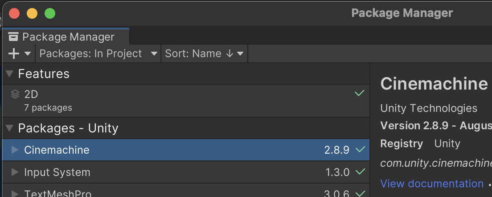
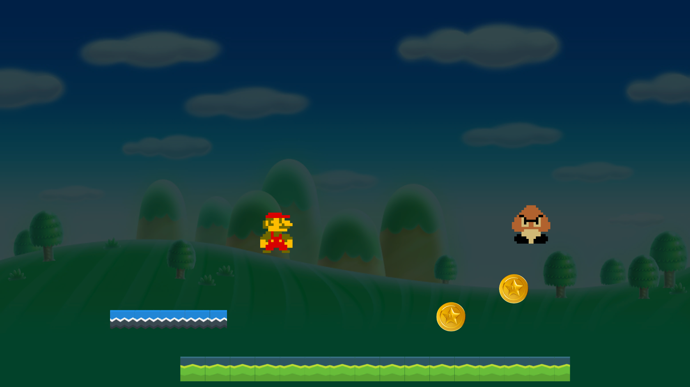

# Basics 1

[Presentation](../presentations/basics1.pdf) -
[Project Files](../projectfiles/basics1.unitypackage) -
[Resources](00_resources.md) -
[Tutorials](00_tutorials.md#basics-1-tutorials) -
[Assignment](#assignment)

## Presentation
This week's [presentation can be found here](../presentations/basics1.pdf)

## Resources
- Our own [tips, tricks and best practices](00_unity.md) for working with Unity, with a bunch of gifs
- A list of [external tutorials](00_tutorials.md#basics-1-tutorials) to help you with specific topics, from learning the basics to creating a certain effect.
- Get graphics, sounds, code and other free stuff from the [resources](00_resources.md) page

## Assignment
1. Download and open Unity
2. Create a new 2D project
3. Download [basics1.unitypackage](../projectfiles/basics1.unitypackage)
4. With the Unity editor open, open the **basics1.unitypackage** file
5. From Window->Package Manager, install **Input System** and **Cinemachine**
6. In the folder Class1/1_ENDSCENE, open the **1_endscene.unity** scene file and press play
7. In the folder Class1/0_STARTSCENE, open the **0_startscene.unity** scene file
8. Drag the prefabs from the folder Class1/Prefabs/Project_Start into the Scene view
9. Finish the game! Use the [Presentation](../presentations/basics1.pdf), [Unity Tips](00_unity.md) and [Tutorials](0_tutorials.md#basics-1-tutorials) to help you on your way. And feel free to look at Class1/1_ENDSCENE/0_startscene.unity to find out how to get there!

> ### What to do for the Start project:
> - **Camera Follow**: Make the camera follow the player using Cinemachine Camera Settings
> - **Configure the Player**: In the Inspector, select the Player_Start object and in *the Inspector view*, drag in the required component references: InputHandler, Animator, AudioClips and GroundCheck.
> - **Programming the Player**: Open PlayerStart.cs and code;
>   - The Jump function
>   - The Move function
>   - The ResetPlayer function
>   - The OnCollisionEnter2D function
>   - The CollectCoin function
> - **Jump Sprite**: Edit the player's jump sprite so that it's the correct one
>   - In Hierarchy view, select the PlayerStart->Graphics object
>   - Open the Animation window in Unity by selecting the menu Window>Animation>Animation
>   - Select the MarioJump_Start animation clip
>   - In Project view, find the Mario from the folder Class1/Graphics/Textures/PNG
>   - Click the triangle near the Mario file to see the different sprites
>   - Drag the correct sprite into the Animation window
> - **Add Coins**: edit the coin prefab and add it to the scene
>   - In the folder Class1/Prefabs/Project_Start, double-click the Coin_Start prefab, and add the Coin script to the prefab
>   - Exit the prefab view, and drag the edited *Coin_Start* prefab somewhere into the scene
> - **Play Around**: make your own level!
>   - Place a few new floors, some more coins and enemies
>   - Check out which sprites are available in Class1/Graphics/Textures/PNG and see if you can use those to make new objects for the game
>   - Get some new sounds and implement them
>   - Done with the game, and you wanna explore? Try out different 2D components, like very useful [Platform Effector](https://docs.unity3d.com/Manual/class-PlatformEffector2D.html), create some 2D objects with RigidBodies and connect them with the different [2D Joints](https://docs.unity3d.com/Manual/Joints2D.html). Make organic looking hills and slopes with [Sprite Shape](https://docs.unity3d.com/Packages/com.unity.2d.spriteshape@10.0/manual/index.html). See if you can make a level with [Tilemaps](https://docs.unity3d.com/Manual/class-Tilemap.html).

### Tips:
Don't forget to install Cinemachine and Input System! You'll get errors and the project won't run if you don't

  
When you open 1_endscene.unity, installed the packages and you press play, it should look like this:
