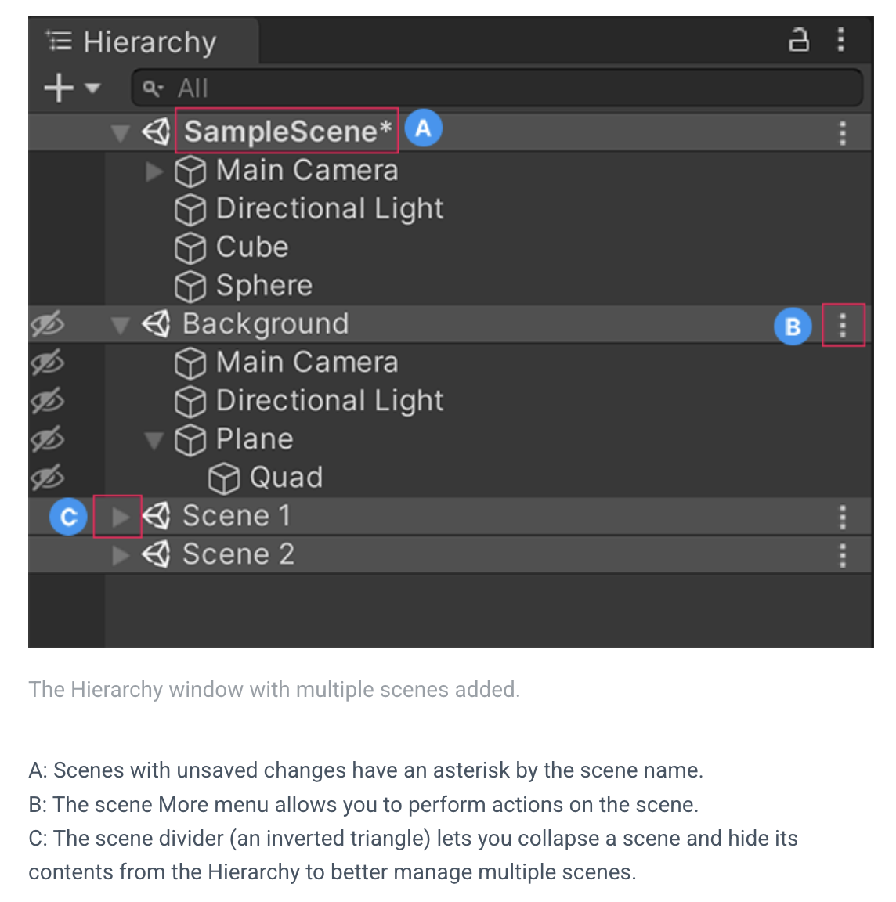

# Game Dev Architecture 1


[Presentation](https://hr-cmgt.github.io/Minor-GDD-Unity/presentation_uisaving) -
[Resources](00_resources.md) -
[Tutorials](00_tutorials.md)

## Presentation
This week's [presentation can be found here](https://hr-cmgt.github.io/Minor-GDD-Unity/presentation_uisaving)

## Resources
- Our own [tips, tricks and best practices](00_unity.md) for working with Unity, with a bunch of gifs
- A list of [external tutorials](00_tutorials.md#ui--saving) to help you with specific topics, from learning the basics to creating a certain effect.
- Get graphics, sounds, code and other free stuff from the [resources](00_resources.md) page

## Assignment
No assignment for this week, apply these topics to your own group project.

<br><br><br>

> ## Topics & Explanation

## Scene hierarchy
  ### Typical scene structure
  > Note: Unity can load scenes additively. This allows for different scene structures. Read more about this here: [Unity Manual: Set Up Multiple Scenes](https://docs.unity3d.com/Manual/setupmultiplescenes.html)


  <details>
  <summary> Multiple Scenes [Fold Out]</summary>

  ### Multiple Scenes In Hierarchy

  In the Hierarchy view, you can add multiple scenes to work in simultaneously.

  > This means that, for example, you can keep a persistent scene and load other scenes on top of it. You can use this to have scripts with persistent data and references, like Managers/Singletons, without worrying that these references break.


  ### DontDestroyOnLoad

  ### Managers, Canvas, Persistent data



  </details>


## Component-based programming
### Component-based programming
- GameObjects are the "physical" objects that exist in a scene. 
- A GameObject can contain multiple components. 
- A component can be a script, a graphics renderer, a physics tool, anything that generates a specific behaviour for an object.
- [ screenshot of components on an object ]

### Prefab as "API"
- Main script as identifier, and as main reference point for other components/scripts

```csharp
public List<EnemyScript> spawnedEnemies;

public void SpawnEnemy()
{
    EnemyScript newEnemy = Instantiate(enemyPrefab);
    spawnedEnemies.Add(newEnemy);
}
```
[ Screenshot of EnemyScript list in Unity ]

### GameProgrammingPatterns
#### Observer/Factory
- Observer: Events & Listeners, 
- Factory: Spawned object has reference to spawnscript, spawnscript keeps list of spawned objects.
- Command: queueing? buffers
- 

### Database and other ways to store data
- ScriptableObjects, classes, structs.
- JSONUtility, PlayerPrefs
- 


### Separate Graphics
- 

### Physics and Logic
- 

### How to refactor?
- 
