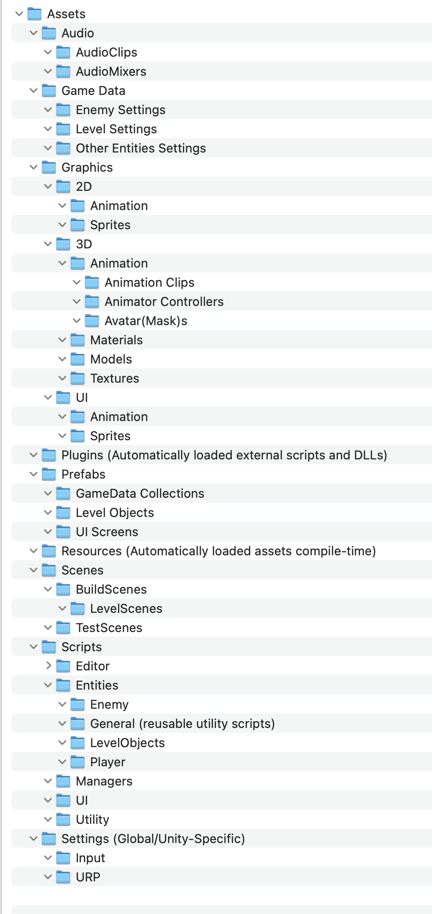
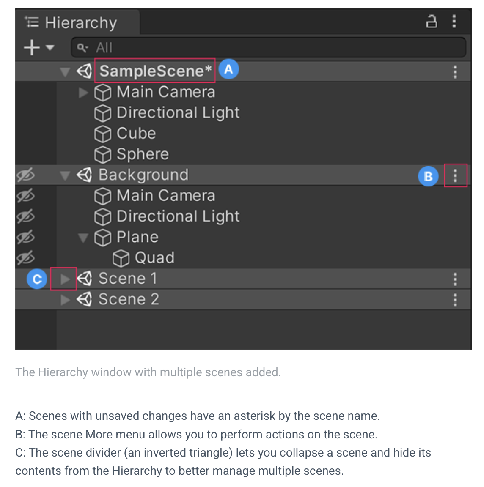

# Game Dev Architecture 1

[Presentation]() -
[Resources](00_resources.md) -
[Tutorials](00_tutorials.md)

## Presentation
This week's [presentation can be found here]()

## Resources
- Our own [tips, tricks and best practices](00_unity.md) for working with Unity, with a bunch of gifs
- A list of [external tutorials](00_tutorials.md#ui--saving) to help you with specific topics, from learning the basics to creating a certain effect.
- Get graphics, sounds, code and other free stuff from the [resources](00_resources.md) page

## Assignment
No assignment for this week, apply these topics to your own group project.


> ## Topics & Explanation
> - Recommended Resources
> - Organising your project
> - Organising your scenes
> - Prefab as “API”
> - Game Programming Patterns

## Folder structure
  ### Typical folder structure
  
  
## Scene hierarchy
  ### Multiple scenes
  > Note: Unity can load scenes additively. This allows for different scene structures. Read more about this here: [Unity Manual: Set Up Multiple Scenes](https://docs.unity3d.com/Manual/setupmultiplescenes.html)

  <details>
  <summary> Multiple Scenes [Fold Out]</summary>

  ### Multiple Scenes In Hierarchy

  In the Hierarchy view, you can add multiple scenes to work in simultaneously.
  
  > This means that, for example, you can keep a persistent scene and load other scenes on top of it. You can use this to have scripts with persistent data and references, like Managers/Singletons, without worrying that these references break.



  ### DontDestroyOnLoad
  [DontDestroyOnLoad (Unity api reference)](https://docs.unity3d.com/6000.3/Documentation/ScriptReference/Object.DontDestroyOnLoad.html)
  ``` csharp


  void Awake()
    {
      // make this object (and its components) persistent even after switching scenes
      DontDestroyOnLoad(this.gameObject);
    }


  ```

  </details>


## Component-based programming
### Component-based programming
- GameObjects are the "physical" objects that exist in a scene. 
- A GameObject can contain multiple components. 
- A component can be a script, a graphics renderer, a physics tool, anything that generates a specific behaviour for an object.
- [ screenshot of components on an object ]

### Prefab as "API"
- Main script as identifier, and as main reference point for other components/scripts

```csharp
public List<EnemyScript> spawnedEnemies;

public void SpawnEnemy()
{
    EnemyScript newEnemy = Instantiate(enemyPrefab);
    spawnedEnemies.Add(newEnemy);
}
```

### Design Patterns In Game Dev

Unity course on Design Patterns:
	- https://learn.unity.com/course/design-patterns-unity-6
#### Observer/Factory
- **Singleton**:
  - Example: Always accessible GameState Manager class for switching game modes
  - YT Tutorial: 
    - [Game Dev Beginner - Singletons in Unity (done right)](https://www.youtube.com/watch?v=yhlyoQ2F-NM)
  - More information: 
    - https://gameprogrammingpatterns.com/singleton.html
  
- **Observer**: 
	- Example: Achievement system
- YT Tutorial:
	- [Jason Weimann - Observer Pattern](https://youtu.be/Yy7Dt2usGy0)
- More information: 
    - https://gameprogrammingpatterns.com/observer.html

### Database and other ways to store data
- ScriptableObjects, classes, structs.
- JSONUtility, PlayerPrefs
- 


### Separate Graphics
- 

### Physics and Logic
- 

### How to refactor?
- 
