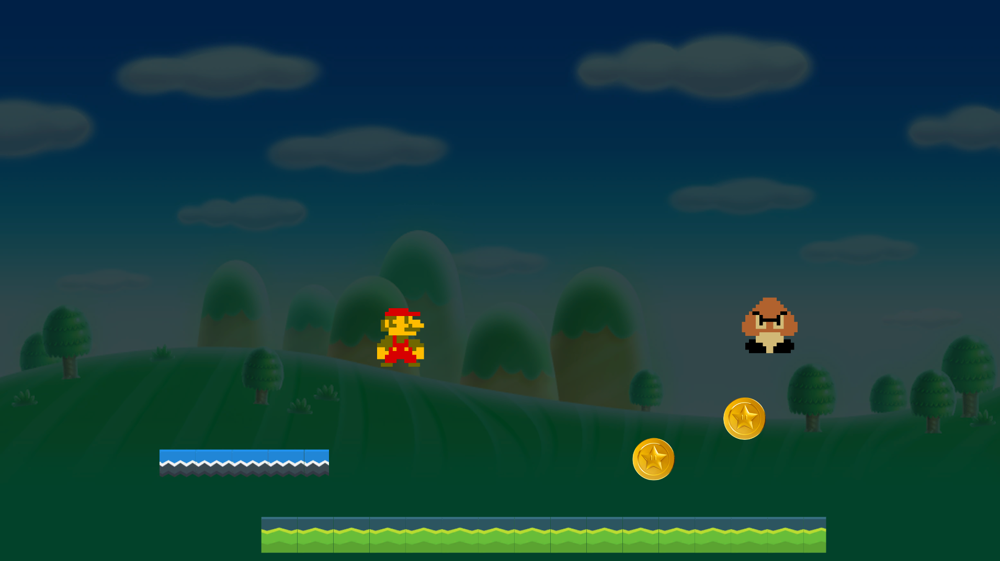

# Basics 1

[Presentation](../presentations/basics1.pdf) -
[Start Project Files](../startprojects/basics1.unitypackage) -
[Resources](0_resources.md) -
[Tutorials](0_tutorials.md#basics-1-tutorials)

## Presentation
This week's [presentation can be found here](../presentations/basics1.pdf)

## Resources
- Our own [tips, tricks and best practices](0_unity.md) for working with Unity, with a bunch of gifs
- A list of [external tutorials](0_tutorials.md#basics-1-tutorials) to help you with specific topics, from learning the basics to creating a certain effect.
- Get graphics, sounds, code and other free stuff from the [resources](0_resources.md) page

## Assignment
1. Download and open Unity
2. Create a new 2D project
3. Download [basics1.unitypackage](../startprojects/basics1.unitypackage)
4. With the Unity editor open, open the **basics1.unitypackage** file
5. From Window->Package Manager, install **Input System** and **Cinemachine**
6. In the folder Class1/1_ENDSCENE, open the **1_endscene.unity** scene file and press play
7. In the folder Class1/0_STARTSCENE, open the **0_startscene.unity** scene file
8. Drag the prefabs from the folder Class1/Prefabs/Project_Start into the Scene view
9. Finish the game! Use the [Presentation](../presentations/basics1.pdf), [Unity Tips](0_unity.md) and [Tutorials](0_tutorials.md#basics-1-tutorials) to help you on your way. And feel free to look at Class1/1_ENDSCENE/0_startscene.unity to find out how to get there!

### Tips:
>Don't forget to install Cinemachine and Input System! You'll get errors and the project won't run if you don't

>  
> When you open 1_endscene.unity, installed the packages and you press play, it should look like this:
