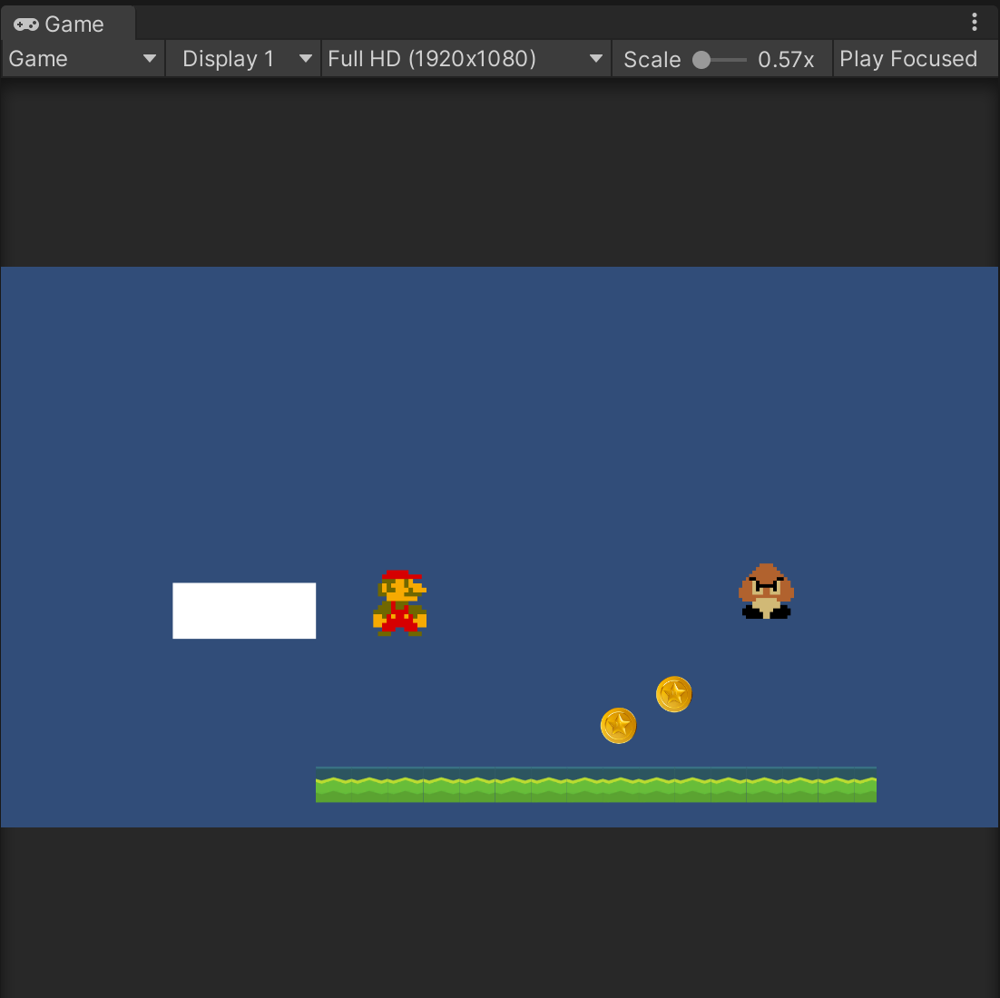

# Basics 1

[Presentation]() -
[Assignment]() -
[Start Project Files]() -
[Resources](0_resources.md) -
[Tutorials](0_tutorials.md) -
[Read More]()

Introduction text hello we're going to start with Unity basics today.

Assignments:
- Download Unity
- Create a new 2D project
- Download [basics1.unitypackage](../startprojects/basics1.unitypackage)
- With the Unity 
- 


Visit [this page for tutorials](0_tutorials.md#basics-1-tutorials) for this week's class


<details>
<summary> Table Of Contents </summary>

</details>

---


## 1. Unity Editor

<details>
<summary> Default windows</summary>


### Project view


### Scene view


### Hierarchy

### Game view


### Inspector

### Console

### Layers


</details>

<details>
<summary> Non-default windows</summary>

#### Package Manager

#### Services

#### Rendering -> Lighting

#### Animation & Animator


#### Audio Mixer

#### Profiler


#### AI -> Navigation


</details>
</blockquote>

</details>


## 2. Scripting & The Unity Editor

<details>

<summary> How Unity handles C# scripts </summary>

### Public variables

<blockquote>
Reference any component/script/gameobject by making a public variable and dragging in the scene-object containing that component
</blockquote>
<br>


### Using Pre-made scripts
<blockquote>
(Re-)use scripts on multiple objects. This is one of the reasons it's good to have multiple, separate scripts on one object. For example, one for tracking health/damage, one for movement patterns, and a separate script for handling graphics, etc.
</blockquote>
<br>


### Prefabs and instances

<blockquote>
Drag a prefab into the Scene/Hierarchy view to create an instance, or create an instance through code by using 

```csharp
GameObject newGameObject = Instantiate(prefabReference); 
```


!Important! Notice the difference between:
- editing a prefab (found in Project view), which is a physical file on your harddrive, which alters all unmodified instances of that prefab
- editing an instance of a prefab, which ONLY affects that one instance but has no relation to the rest
- editing a prefab when an instance has been modified. The prefab is the "origin" file, and should affect all instances in the scene, EXCEPT for when these instances have been modified.  

</blockquote>
<br>


### Sprites

<blockquote>
Quick tip to work with spritesheets and animations:
When sprites are sliced (Sprite Mode: Multiple), drag the file into the Scene view and Unity will ask you to auto-generate an Animator Contoller and an animation clip (file) for you.
</blockquote>
<br>


### Sounds


</details>


## 3. Scripting

<details>
<summary> Scripting in Unity's C#  </summary>

### Script order of execution

[Unity Manual: Script Execution Order](https://docs.unity3d.com/Manual/ExecutionOrder.html)
[](https://docs.unity3d.com/Manual/ExecutionOrder.html)

### Unity's built-in functions/methods

### How scripts talk to each other

</details>

## 4. Physics
<details>
<summary> Physics in Unity </summary>

### Raycasting
### AddForce
### Velocity
### Checking Collisions
### Physics Tips
#### Use FixedUpdate
#### Move the RigidBody, not the Transform

</details>

## 5. Miscellaneous

<details>
<summary> Various Tips & Best Practices </summary>

### Play mode edits = lose changes
### Transform
### Instantiate
### Input (GetAxis basic)
### Input (InputSystem)
### GameManager (?)

</details>