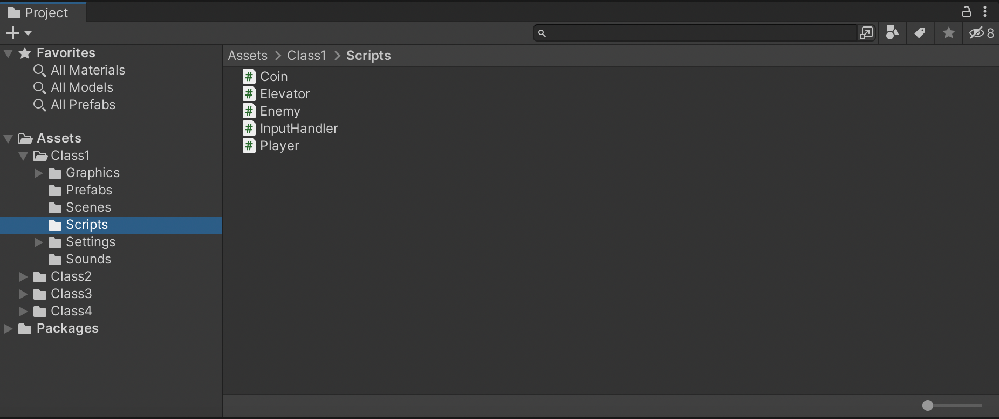
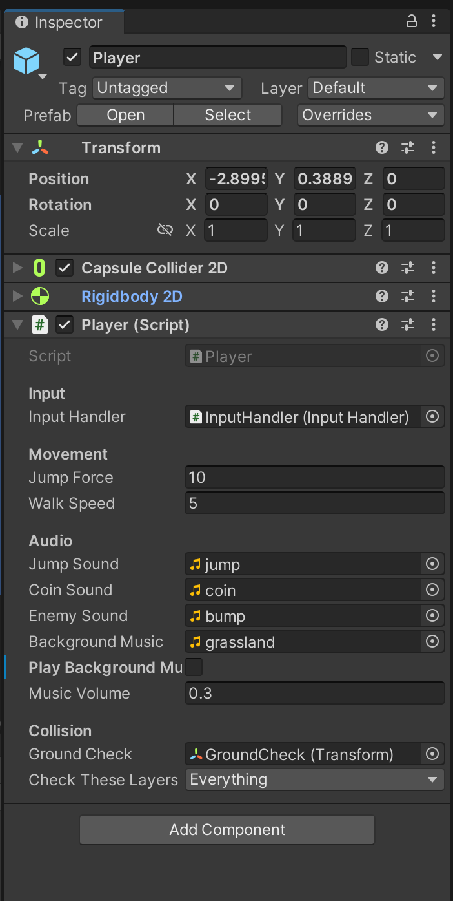
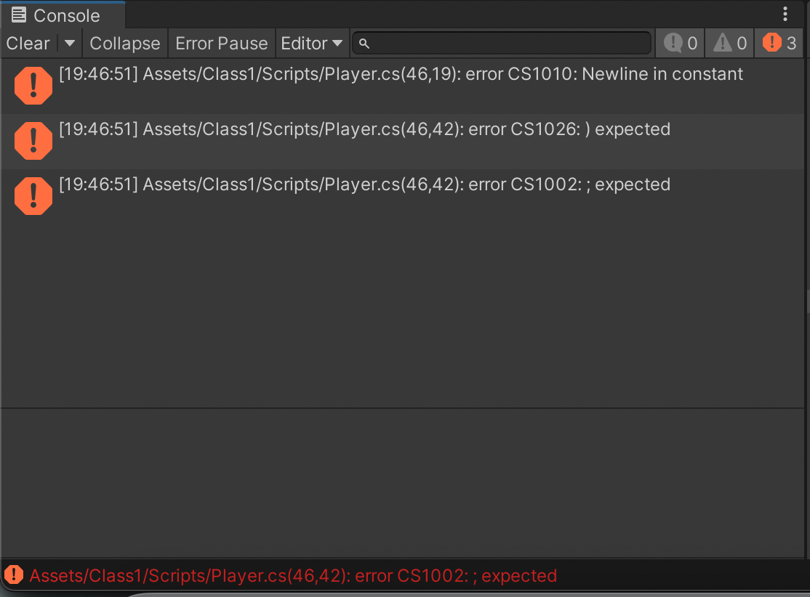
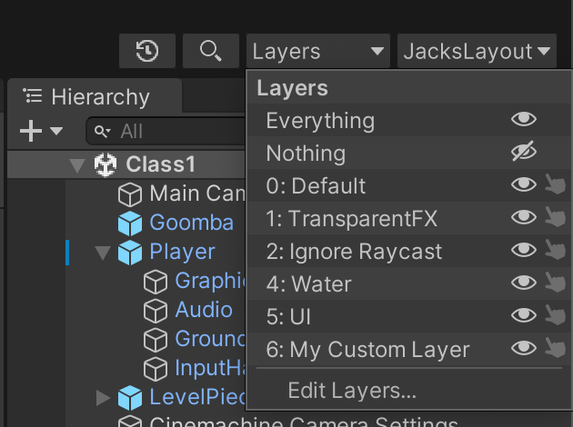
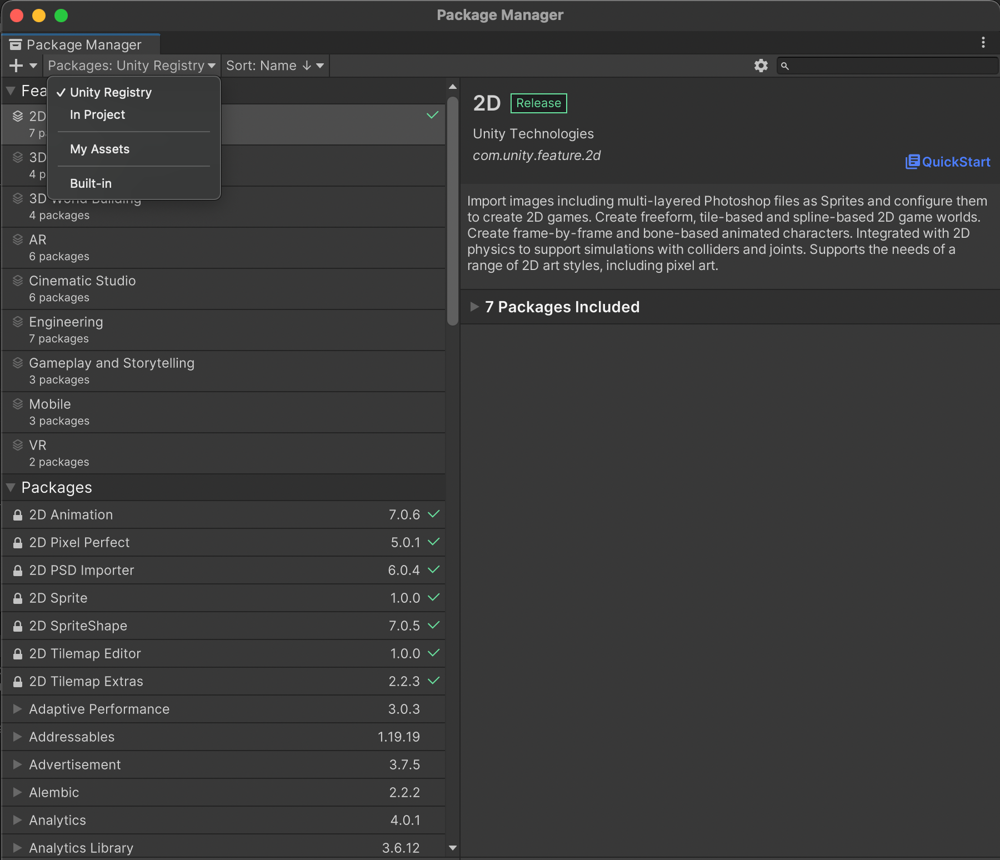
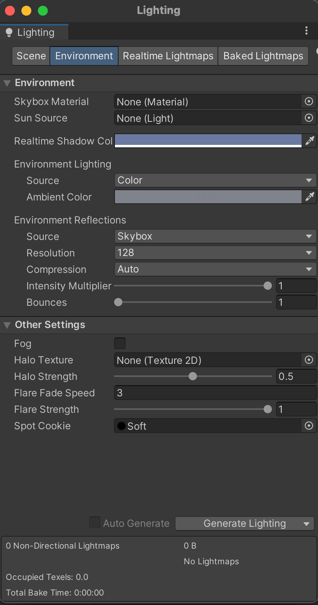
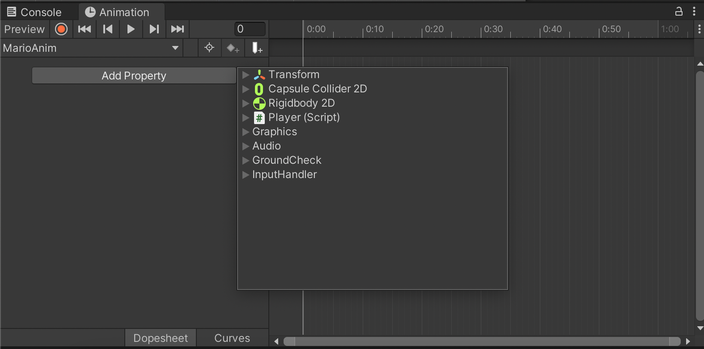
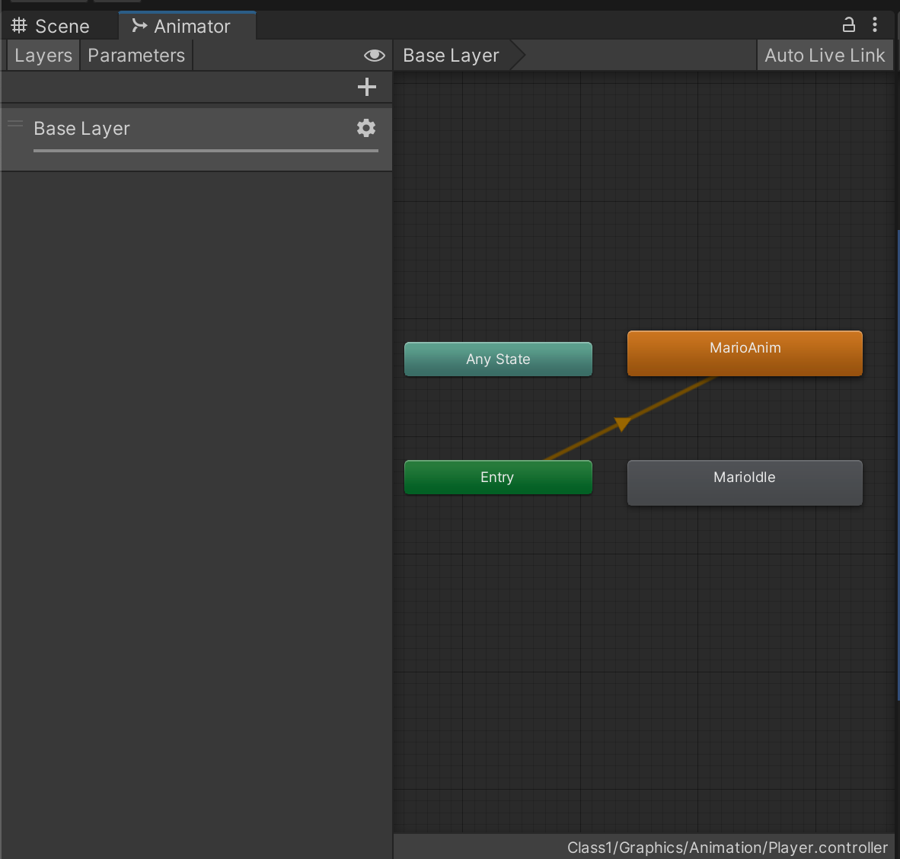
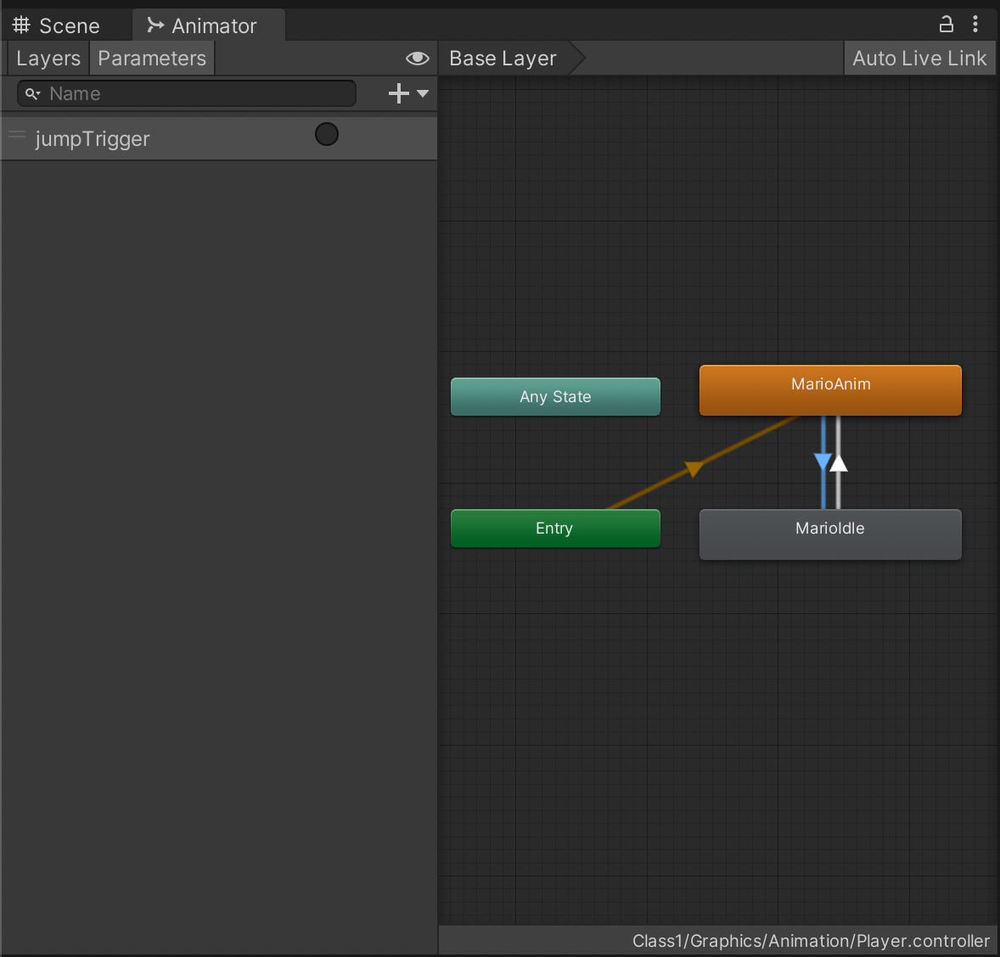

# Basics 1

## Introduction To Unity

## Unity Editor
### Project view

### Scene view

### Hierarchy

### Game view

### Inspector

### Console

### Layers

### Non-default windows
#### Package Manager

#### Services

#### Rendering -> Lighting

#### Animation & Animator

#### Audio Mixer

#### Profiler

#### AI -> Navigation

## Scripting & The Unity Editor
### Public variables
### Using Pre-made scripts
### Prefabs and instances
### Sprites
### Sounds

## Scripting
### Script order of execution
#### Awake
#### Start
#### Update
#### FixedUpdate
### Unity's built-in functions/methods
### How scripts talk to each other

## Physics
### Raycasting
### AddForce
### Velocity
### Checking Collisions
### Physics Tips
#### Use FixedUpdate
#### Move the RigidBody, not the Transform

## Miscellaneous
### Play mode edits = lose changes
### Transform
### Instantiate
### Input (GetAxis basic)
### Input (InputSystem)
### GameManager (?)