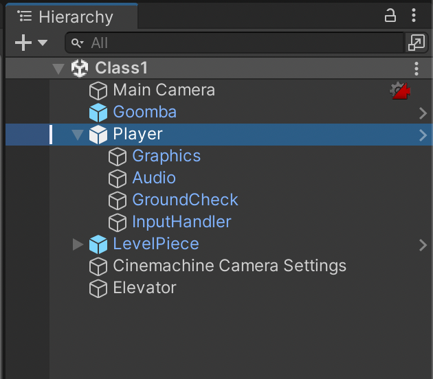
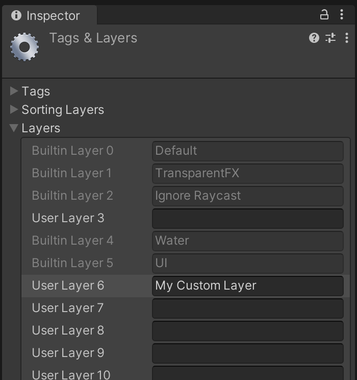
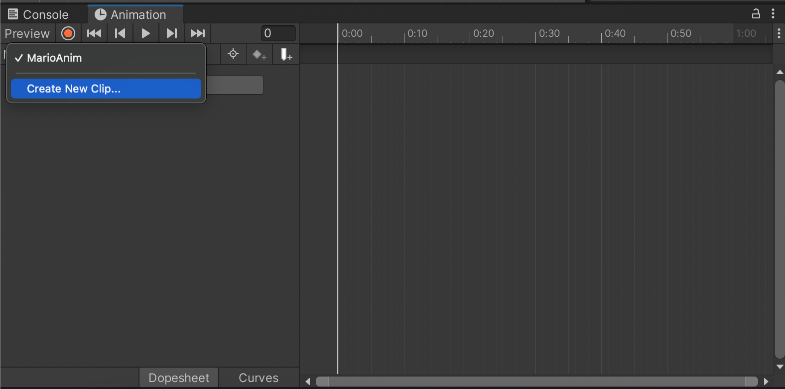
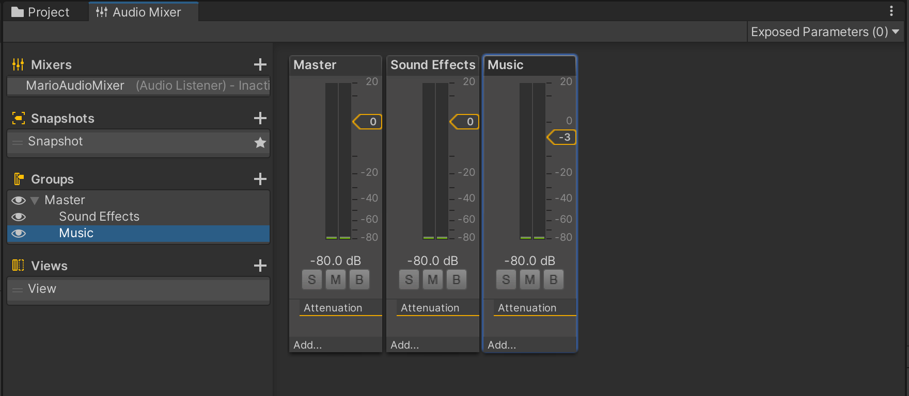
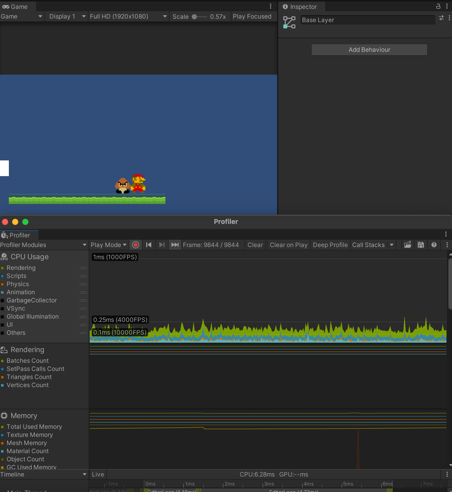
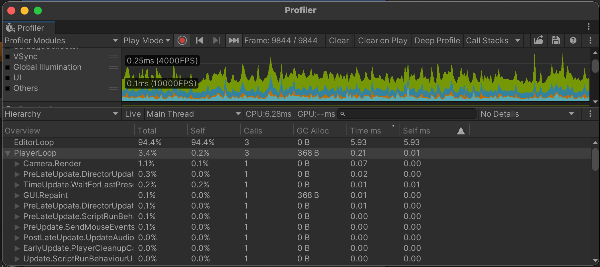
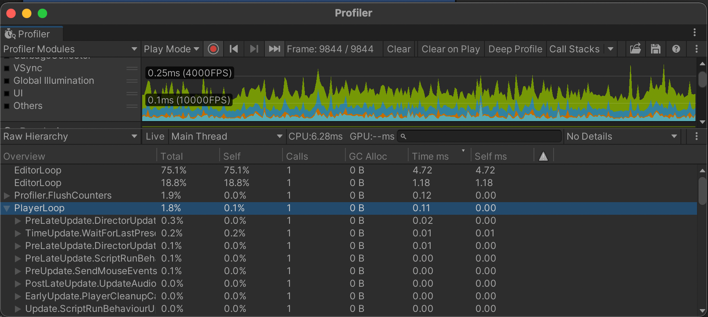

# Basics 1

## Introduction To Unity

[Presentation]() -
[Assignment]() -
[Start Project Files]() -
[Resources]() - 
[Read More]()

Introduction text hello we're going to start with Unity basics today.
Assignments:
- [TEMP]
- Get familiar with the Unity interface
- 

<details>
<summary> Table Of Contents </summary>

- [Basics 1](#basics-1)
  - [Introduction To Unity](#introduction-to-unity)
    - [Project view](#project-view)
    - [Scene view](#scene-view)
    - [Hierarchy](#hierarchy)
    - [Game view](#game-view)
    - [Inspector](#inspector)
    - [Console](#console)
    - [Layers](#layers)
      - [Package Manager](#package-manager)
      - [Services](#services)
      - [Rendering -\> Lighting](#rendering---lighting)
      - [Animation \& Animator](#animation--animator)
      - [Audio Mixer](#audio-mixer)
      - [Profiler](#profiler)
      - [AI -\> Navigation](#ai---navigation)
  - [Scripting \& The Unity Editor](#scripting--the-unity-editor)
    - [Public variables](#public-variables)
    - [Using Pre-made scripts](#using-pre-made-scripts)
    - [Prefabs and instances](#prefabs-and-instances)
    - [Sprites](#sprites)
    - [Sounds](#sounds)
  - [Scripting](#scripting)
    - [Script order of execution](#script-order-of-execution)
    - [Unity's built-in functions/methods](#unitys-built-in-functionsmethods)
    - [How scripts talk to each other](#how-scripts-talk-to-each-other)
  - [Physics](#physics)
    - [Raycasting](#raycasting)
    - [AddForce](#addforce)
    - [Velocity](#velocity)
    - [Checking Collisions](#checking-collisions)
    - [Physics Tips](#physics-tips)
      - [Use FixedUpdate](#use-fixedupdate)
      - [Move the RigidBody, not the Transform](#move-the-rigidbody-not-the-transform)
  - [Miscellaneous](#miscellaneous)
    - [Play mode edits = lose changes](#play-mode-edits--lose-changes)
    - [Transform](#transform)
    - [Instantiate](#instantiate)
    - [Input (GetAxis basic)](#input-getaxis-basic)
    - [Input (InputSystem)](#input-inputsystem)
    - [GameManager (?)](#gamemanager-)

</details>

---

<details>
<summary> Unity Editor</summary>

<blockquote>
<details>
<summary> Default windows</summary>

### Project view

### Scene view

### Hierarchy

### Game view


### Inspector

### Console

### Layers


</details>

<details>
<summary> Non-default windows</summary>

#### Package Manager

#### Services

#### Rendering -> Lighting

#### Animation & Animator





#### Audio Mixer

#### Profiler




#### AI -> Navigation


</details>
</blockquote>

</details>

<details>
<summary> Scripting & The Unity Editor </summary>

## Scripting & The Unity Editor
### Public variables
<blockquote>
Reference any component/script/gameobject by making a public variable and dragging in the scene-object containing that component
</blockquote>
<br>


### Using Pre-made scripts
<blockquote>
(Re-)use scripts on multiple objects. This is one of the reasons it's good to have multiple, separate scripts on one object. For example, one for tracking health/damage, one for movement patterns, and a separate script for handling graphics, etc.
</blockquote>
<br>


### Prefabs and instances

<blockquote>
Drag a prefab into the Scene/Hierarchy view to create an instance, or create an instance through code by using 

```csharp
GameObject newGameObject = Instantiate(prefabReference); 
```


!Important! Notice the difference between:
- editing a prefab (found in Project view), which is a physical file on your harddrive, which alters all unmodified instances of that prefab
- editing an instance of a prefab, which ONLY affects that one instance but has no relation to the rest
- editing a prefab when an instance has been modified. The prefab is the "origin" file, and should affect all instances in the scene, EXCEPT for when these instances have been modified.  

</blockquote>
<br>


### Sprites

<blockquote>
Quick tip to work with spritesheets and animations:
When sprites are sliced (Sprite Mode: Multiple), drag the file into the Scene view and Unity will ask you to auto-generate an Animator Contoller and an animation clip (file) for you.
</blockquote>
<br>


### Sounds


</details>

<details>
<summary> Scripting </summary>

## Scripting
### Script order of execution

[Unity Manual: Script Execution Order](https://docs.unity3d.com/Manual/ExecutionOrder.html)
[](https://docs.unity3d.com/Manual/ExecutionOrder.html)

### Unity's built-in functions/methods


### How scripts talk to each other

</details>

<details>
<summary> Physics </summary>

## Physics
### Raycasting
### AddForce
### Velocity
### Checking Collisions
### Physics Tips
#### Use FixedUpdate
#### Move the RigidBody, not the Transform

</details>

<details>
<summary> Miscellaneous </summary>

## Miscellaneous
### Play mode edits = lose changes
### Transform
### Instantiate
### Input (GetAxis basic)
### Input (InputSystem)
### GameManager (?)

</details>