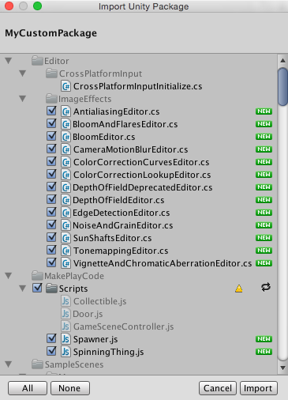

Download the `.unitypackage` files directly:
- [Download basics1.unitypackage](https://github.com/HR-CMGT/Minor-GDD-Unity/raw/master/projectfiles/basics1.unitypackage) (Class 1)
- [Download basics2.unitypackage](https://github.com/HR-CMGT/Minor-GDD-Unity/raw/master/projectfiles/basics2.unitypackage) (Class 2 - Unity 6.3)

---

### How to Import:
1. With the Unity editor open, open (double-click) the .unitypackage file in Windows/Mac/Linux
2. In the "Import Unity Package" dialog window, click "Import"

Second method:
1. Open the project in the Editor where you want to import the asset package.
2. Choose Assets > Import Package > Custom Package. A file browser appears, prompting you to locate the .unitypackage file.
3. In the file browser, select the file you want to import and click Open.
4. The Import Unity Package window displays all the items in the package already selected, ready to install.

Reference: [Unity Manual - Import Local Asset Packages](https://docs.unity3d.com/Manual/AssetPackagesImport.html)

